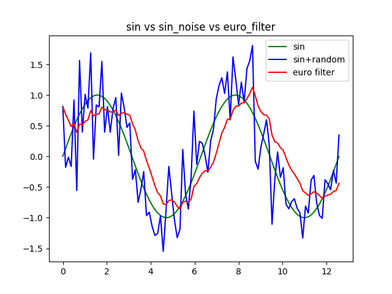

如果公式显示异常，可以查看pdf版本（./images/README.pdf）

### 姿态消抖-euro filter

#### 1. 任务定义

在2D/3D姿态估计中，常常出现关键点高频抖动的情况，特别是3D姿态驱动动画模型的场景下，动画模型好像帕金森患者一样，极大影响视觉感官效果。为了解决关节点高频抖动的问题，采用euro滤波器消除抖动，在实际测试中发现姿态估计中关键点抖动问题主要来源于目标检测模型和姿态估计模型，对目标框和关节点结果同时进行滤波后，姿态估计在视觉感官上有了极大的提升。


#### 2. 原理分析

##### 2.1 euro滤波器

euro是一种能够实时滤除噪声的低通滤波器，而且只需要调整两个参数（最小截止频率和速度系数），一般需要调节这两个参数达到动态平衡的效果，降低最小截至频率可以大幅度的降低抖动，但是会出现延迟，增加速度系数可以降低延迟，但是去抖效果会大大降低。假设信号 $T_i$时刻的值为$X_i$ ，滤波后的信号值为 $\hat{X_i}$ 。滤波器采用指数平滑进行滤波：
$$
\begin{gathered}
\hat{X}_1=X_1 \\
\hat{X}_i=\alpha X_i+(1-\alpha) \hat{X}_{i-1}, \quad i \geq 2
\end{gathered}
$$
其中平滑系数$\alpha \in[0,1]$, $\alpha$ 系数可以根据信号输入改变的速率进行自适应调整，这个自适应平滑系数主要的作用就是维持去抖效果和延迟之间的平衡，人眼对低速情况下的抖动，高速情况下的延迟都非常敏感。平滑因子可以定义为：
$$
\alpha=\frac{1}{1+\frac{\tau}{T_e}}
$$
其中 $T_e$ 是两个相邻时刻的采样周期: $T_e=T_i-T_{i-1}$, $\tau$ 是由截止频率计算出的时间常量 $\tau=\frac{1}{2 \pi f_C}$ , 截止频率 $f_C$ 与信号变换速率成线性关系：
$$
f_C = f_{C_{min}}+\beta|\hat{\dot{X_i}}|
$$
其中$f_{C_{min}}>0$ 为最小截至频率，$\beta > 0$ 为速率系数，$\hat{\dot{X_i}}$ 为速率变化，可以速率定义变化作为信号的离散导数：
$$
\dot{X_1}=0 \\
\dot{X}_i=(X_i-\hat{X}_{i-1})/T_e, \space i>=2
$$

##### 2.2 算法实现流程

下面采用伪代码的形式逐步实现euro滤波器：

$\operatorname{Smoothing-Factor}(f_C,T_e)$

1. $\space r=2\pi * f_c * T_e$
2. $\space \text{return} \space r/(r+1)$

$\operatorname{Exponential-Smoothing}(\alpha, X_i, \hat{X}_{i-1})$

1. $\space \text{return} \space \space \alpha X_i+(1-\alpha)\hat{X}_{i-1}$

$\operatorname{One-Euro-Filter}(T_i,X_i,T_{i-1},\hat{X}_{i-1},\hat{\dot{X}}_{i-1},f_C,β,f_{C_d})\space \space i≥2$

1. $T_e = T_i-T_{i-1}$
2. $\operatorname{Smoothing-Factor}(T_e,f_{C_d})$
3. $\dot{X}_i=(X_i-\hat{X}_{i-1})/T_e$
4. $\operatorname{Exponential-Smoothing}(\alpha_d, \dot X_i, \hat{\dot{X}}_{i-1})$
5. $f_C = f_{C_{min}}+\beta|\hat{\dot{X_i}}|$
6. $\operatorname{Smoothing-Factor}(f_C,T_e)$
7. $\operatorname{Exponential-Smoothing}(\alpha, X_i, \hat{X}_{i-1})$
8. $\text{return} \space \space T_i, \hat{X}_i, \hat{\dot{X}_i}$

##### 2.3 Python实现

```python
#!/usr/bin/env python
# -*- coding: UTF-8 -*-
'''
@Project ：3d-pose-estimation 
@File    ：euroFilter.py
@Author  ：Xie Zhongzhao
@Date    ：2022/3/24 10:27 
'''
import time

import matplotlib.pyplot as plt
import numpy as np
import math

class OneEuroFilter:

    def __init__(self, t0, x0, dx0=0.0, min_cutoff=1.0, beta=0.0, d_cutoff=1.0):
        """Initialize the one euro filter."""
        # The parameters.
        self.min_cutoff = float(min_cutoff)
        self.beta = float(beta)
        self.d_cutoff = float(d_cutoff)

        # Previous values.
        self.x_prev = x0
        self.dx_prev = float(dx0)
        self.t_prev = t0

    def smoothing_factor(self, t_e, cutoff):
        r = 2 * math.pi * cutoff * t_e
        return r / (r + 1)

    def exponential_smoothing(self, a, x, x_prev):
        return a * x + (1 - a) * x_prev

    def filter_signal(self, t, x):
        """Compute the filtered signal."""
        t_e = t - self.t_prev

        # The filtered derivative of the signal.
        a_d = self.smoothing_factor(t_e, self.d_cutoff)
        dx = (x - self.x_prev) / t_e
        dx_hat = self.exponential_smoothing(a_d, dx, self.dx_prev)

        # The filtered signal.
        cutoff = self.min_cutoff + self.beta * abs(dx_hat)
        a = self.smoothing_factor(t_e, cutoff)
        x_hat = self.exponential_smoothing(a, x, self.x_prev)

        # Memorize the previous values.
        self.x_prev = x_hat
        self.dx_prev = dx_hat
        self.t_prev = t

        return x_hat


if __name__ == '__main__':

    np.random.seed(1)

    # Parameters
    frames = 100
    start = 0
    end = 4 * np.pi
    scale = 0.5

    # The noisy signal
    t = np.linspace(start, end, frames)
    x = np.sin(t)
    x_noisy = x + np.random.normal(scale=scale, size=len(t))

    # The filtered signal
    min_cutoff = 0.15
    beta = 0.01
    x_hat = np.zeros_like(x_noisy)
    x_hat[0] = x_noisy[0]

    one_euro_filter = OneEuroFilter(t[0], x_noisy[0], min_cutoff=min_cutoff, beta=beta)
    for i in range(1, len(t)):
        x_hat[i] = one_euro_filter.filter_signal(t[i], x_noisy[i])

    plt.plot(t, x, label="sin", color='g')
    plt.plot(t, x_noisy, label='sin+random', color='b')
    plt.plot(t, x_hat, label='euro filter', color='r')
    plt.title("sin vs sin_noise vs euro_filter")
    plt.legend()
    plt.show()
    plt.savefig("./euroImg.png")
```

最小截止频率min_cutoff为0.15，速率系数beta为0.01，d_cutoff=1.0，这里强调一下，在姿态滤波时d_cutoff一般等于视频帧率，滤波效果如下图：



最小截止频率min_cutoff为0.05，速率系数beta为0.01，滤波效果如下图：


最小截止频率min_cutoff为0.15，速率系数beta为0.60，滤波效果如下图：


总结：降低最小截至频率可以大幅度的降低抖动，但是会出现延迟，增加速度系数可以降低延迟，但是去抖效果会大大降低。

#### 3. 实现效果

下面的跳舞教学视频，采用**精度较差的人体姿态模型**推理关节点位置，可以看到关键点狂魔乱舞的状态：


通过euro滤波器对关节点进行简单处理后，关节点就会变得非常丝滑：


#### 4. 参考文献

[Noise Filtering Using 1€ Filter](https://jaantollander.com/post/noise-filtering-using-one-euro-filter/)

https://link.zhihu.com/?target=https%3A//cristal.univ-lille.fr/~casiez/1euro/


